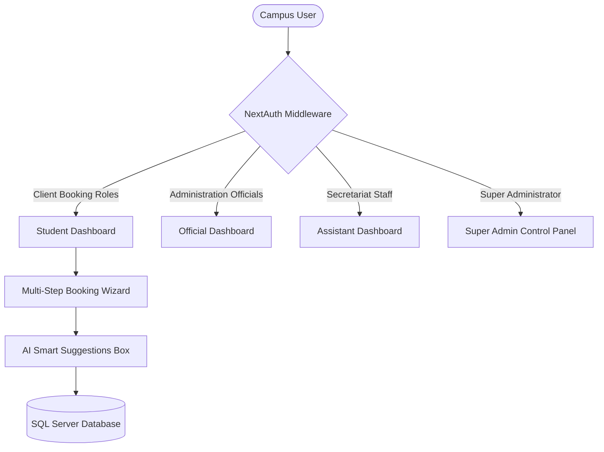

# 🎓 Hazara University SUAMS — Technical System Documentation

This document serves as the complete technical manual, system architecture layout, database guide, and user manual for the **Smart University Appointment Management System (SUAMS)** at Hazara University.

---

## 1. Project Overview & Objectives
Hazara University is a large academic institution requiring frequent coordination between students, parents, faculty, visitors, and key administration figures (e.g. Vice Chancellor, Registrar, Deans, HODs). Traditional appointment queues often lead to:
- Long waiting times and crowded administrative blocks.
- Lack of security check validation for campus visitors.
- Double bookings or slot overlaps.
- Difficulty tracking historical meeting logs.

**SUAMS** digitizes this entire flow, providing:
1. A multi-step validation booking desk.
2. Direct role-based dashboards to approve, reject, reschedule, or delegate tasks.
3. AI secretary routing and priority classification.
4. Entry point validation via digital printable QR codes.

---

## 2. Technology Stack & Key Decouplings

- **Client & Server Engine**: Next.js 16 (App Router)
- **Programming Language**: TypeScript
- **CSS Architecture**: Vanilla custom HSL tokens mapped globally inside standard stylesheet (`globals.css`)
- **Database Engine**: Microsoft SQL Server / Prisma ORM
- **Authentication**: NextAuth.js JWT session protection
- **Animation Framework**: Framer Motion transitions

---

## 3. System Architecture & RBAC Flow



---

## 4. Database Design & Relational Tables
SUAMS uses a normalized relational model configured in `schema.prisma`.

### Main Table Relational Mappings:
1. **User**: Stores login credentials, emails, passwords, and user category references.
2. **Role**: Enum containing 15 distinct permissions classes (Admin, VC, Student, Teacher, etc.).
3. **Faculty**: Represents major university faculties (Natural Sciences, Social Sciences, etc.).
4. **Department**: Maps to parent Faculty and lists BS degree programs.
5. **Official**: Allocates office block numbers, titles, and office hours boundaries.
6. **TimeSlot**: Track booked and reserved slots to prevent cyclic double-bookings.
7. **Appointment**: Coordinates details, reasons, PDF attachment files, status states (Approved/Pending/Cancelled), and unique QR slip keys.
8. **Notification**: Dispatches real-time alerts.
9. **AuditLog**: Stores login sessions and database configurations trace.

---

## 5. Folder Structure
```text
suams-app/
├── app/
│   ├── (auth)/          # Credentials authorization portals
│   ├── (dashboard)/     # Customized workspaces mapped by role
│   ├── api/             # API data routers
│   └── appointments/    # Steps wizard layout
├── components/          # Global reusable UI modules
│   ├── chatbot/         # Floating AI Assistant
│   └── dashboard/       # Header stats and items
├── lib/                 # Core singletons and auth middleware
└── prisma/              # Schema blueprints
```

---

## 6. Operation Manuals

### A. Student & Booking User Manual
1. Access `/appointments` to open the multi-step booking wizard.
2. Select your Category and Faculty department.
3. Choose the target Official and dates.
4. Input details (subject, reason) to get real-time AI priority analysis.
5. Confirm and download the printable QR entry slip.

### B. Assistant Office Manual
1. Access `/assistant` dashboard.
2. Review the pending requests queue table.
3. Click "Review" to see details, files, and HEC attachments.
4. Trigger actions: *Approve*, *Suggest Reschedule*, *Reject with reason*, or *Assign room*.

### C. University Official Manual
1. Access `/official` dashboard.
2. View "Today's Schedule" timeline to inspect upcoming appointments.
3. Toggle Availability settings or specify vacation blocks inside the settings tab.

### D. Super Admin Manual
1. Access `/admin` panel.
2. Manage user status registers (activate/suspend).
3. Update brand names and configure SMTP email/SMS gate servers.
4. Trigger and download `.sql` database snapshots.

---

## 7. Deployment Guide
1. Set environmental parameters in production (NextAuth URLs, secrets).
2. Configure MS SQL Server connectivity string.
3. Run compiler check: `npm run build`.
4. Deploy Next.js build output behind an Nginx proxy or Vercel edge nodes.
